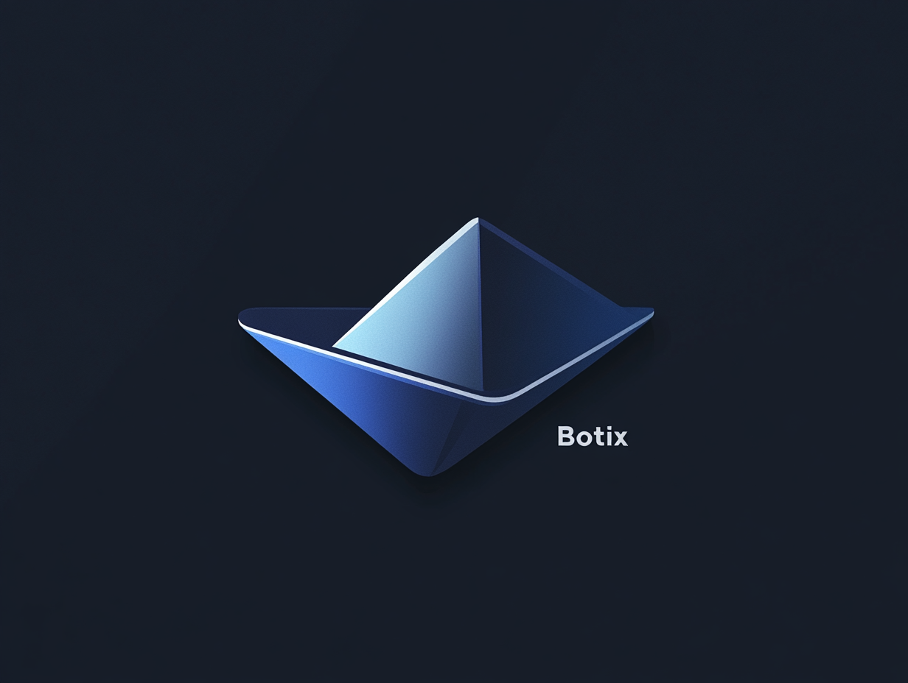

# 🚀 Botix - Remote ⁤‍‌‍‍⁡‌‍‌⁢‌‍⁢‍‌‌‌‍‌⁤⁣‍‍‌‌⁡⁢‍⁣‌‌⁡‌⁣⁢‌⁢‍‍‍⁢⁡‌⁡⁢‍‍‌⁢‌‍‍‌⁡‌‍‌⁤⁡‍⁡⁢⁡‌‌‍‌⁣‌⁣‌⁤⁤‌⁡⁢‍‌‌⁢‍‍‌⁢‌‌⁡‍⁢⁡‍‍⁡‌‍⁢‌⁡‌‌‍‌⁢‌‍‌‍⁤⁢⁡⁤⁢‌‍⁢‍⁢‌‍‌⁡⁢‍‌‍⁣‌⁡⁢‍⁣⁢⁡⁢‌⁤⁢‍‍⁢⁡‌‍⁢‍⁡‍⁣‍‍‍⁡‌‍‌⁡‌‌⁡‍⁢‌⁢‍‍‌‌‍⁣‌⁤‍⁡‍‌‍‍‌‍⁢⁡⁢‌⁡‍⁤⁡‌‍‍⁢‌‍⁢⁣‍⁡⁢‍⁢‍‌⁢‍‍‍‍‍⁡‌⁡⁢‍‌⁢‍⁤‍⁢⁣⁢⁡⁤‍‌‌‌⁡‌‍⁡⁢⁣‍⁢⁡‌⁡⁤‌⁢⁣‍⁤⁢‌⁤⁣⁡‌‌⁡⁢⁡‍‌‍⁣‌⁢⁡‍‍⁣‌⁢‌‍⁡‍‌⁡⁢⁡⁢‌‍⁢‌‍⁣‌⁤‍‌⁢‍⁤⁣‍⁤‍‌‌‍⁢‍⁤⁢‌⁤⁡‍‌⁣⁡‌‌‍⁡⁤‌⁡‍‌⁢⁡‍⁡‌‍⁡‌‍⁢⁡⁢⁡‍‍⁡‍‍⁢‍⁢⁡⁤⁡⁢‍⁢⁡‌⁡‌⁡‍‌‍⁡‍⁡⁢⁣⁡‍‍⁡⁢⁡‍⁢‍⁢‌‌⁡‍‌⁢‍‍‌⁢‌⁢‌⁤⁣‌⁣⁢‌⁢‍‍⁤⁢‌‌‌‍⁡‍‌‍⁡‍⁣⁣⁡‍‍‌⁡⁢⁡⁢‍⁢⁡‌‍‍⁢‍‌‌⁢⁡‍⁡‍‌⁢‌⁢‌⁤⁤‌‍⁢‌‍‍‌‌‌‌‍‌⁡‍‌‌‌⁢‌⁡‌⁡‍‍⁤‍⁢‌⁢‍⁡⁢‍‍⁡‍‍‍‌⁢‍⁡‌⁣‍⁢‌‍‍‍⁢‌⁡‌‍⁢‌‌‌⁢⁡‍‍‍‍‍⁢⁡‌⁢‌‍⁡⁢‌‍‍⁢‌‌⁡⁢‍‌⁤‌‌‍‌‍‌⁢⁡‍‌⁢⁣⁡‍‌⁤‍⁡‌‍⁢‍⁢⁡⁢‍‌⁡⁢‌⁡‌‌‌‌‌⁡‌⁡‍‌‌⁡‍‍‌⁣‌‌‌⁢‍‌⁣‍⁡‌‌⁡⁢‌⁢⁣‌‌⁢‌‍‍⁤⁡‌⁤⁤‌‍⁤‍⁢‌⁡⁢‌⁡‍⁤‌‌⁢‍‌⁢⁡‍‍⁤‍⁡‍‌⁡⁢‌‍⁢‌⁡‌⁡⁢‌‍⁡‌⁢‍‌⁢⁡‌‍‍⁡‍‌⁢‍⁣‍⁡‌⁢‌‌⁤‌‌‍‍⁢‍‌⁢⁡⁢‌⁢‍⁤‌⁤‌⁡‌‍⁣⁢‌⁢‍⁡⁢‌⁢‍‍⁡‌‌‌⁢‍‍‌⁢‌⁡‌‍‌⁤‍‍‍‌⁡‌‍⁤⁤⁣⁤‌‍‌‌⁢⁡‍⁡‍‍⁢‌‌⁡‌⁡‌‍⁡‍⁢⁡⁢‌‌⁡‌‍‍‍⁡‍‌⁢⁡‌⁢‍‍‌‍‌⁡‌‌⁡‍⁡‍⁤‌⁢‌‍⁤‌⁢⁡‍⁡‍⁢‌⁣⁢⁣‌‍⁢⁣⁢⁡‍‍⁤‌‍‍‍⁡‍⁢‌‌⁤⁣‍⁢⁡⁢‌‍⁢⁣⁢‍‍⁤‌⁣⁣⁢⁡‍⁡‌‍⁢‌‍‌‌⁡⁢‍‍‍‌⁤⁢‌‍⁡⁢⁡⁢‌‍⁢⁣⁢‍⁡‌⁣‌⁡⁢‍‍‌‍‌⁣⁢‌⁡⁤⁡‍‍‌‍⁢‍⁢⁡‌‌⁡‌‌⁡‌‌‍⁤⁡⁤‍‍‍‌⁡‍⁤‍⁢‌⁤⁡‌‍‌⁣‍‍‌‌⁡‍⁡‌⁢‍⁡‌⁣‌‍⁤‍‌‍‍‍⁡⁤‌⁢‍⁡⁤‌⁡⁢⁣‍‌⁢‍⁢‍⁡‍‍‍‌⁢‍‌⁢⁡⁢‌⁡‌‍⁤‌⁤⁣⁢‌⁢⁡‌‍⁢‍⁣‌‌‌‌‌⁡‌‌⁡‌‌‍‍‍‌⁣⁤‌‌‌‌‌⁡‌‍⁣⁤‍‌⁣⁡‍‌‌⁡‍‌‌⁢‌‌‍⁢‍‌‍⁢⁣⁡‍⁡‍⁢‍‌‌⁡‌‍‍⁡‌‍⁢⁣‍‌‌‌‍‍‍⁢‍⁢‌‌‌⁣⁢‍‍‍‍‌⁢‌⁡‌‌‌⁢‍‌⁡‌⁣⁢‍‍⁡‌‌‌‌‌‌‌‍⁡‌⁢⁡‍‍⁢‌‌⁢‌‍‌‌⁡‍⁤⁢‍‌⁤‍‌⁡‍⁡‍‌⁢⁡‍⁡⁢‌⁢⁣⁢⁣⁡‌‌⁢‌‍⁡‌⁢‌⁡‌⁢⁡‍‌‍‌‍‌⁢‌‌‍⁢⁡‌‍‍‍⁢‍⁡‍⁢‍‌‍‌⁡‌‍‌‍‍⁢‍⁢⁣‍⁡⁢‌‌‍⁢‍⁡⁢‌‍⁢‌⁢⁡‍⁡⁢‍⁡‌⁤‍‍⁢⁣‌⁢⁡‍‍‌⁡‌‍⁢‍‍‍‌‌‌‍‍‌‌‍‍⁢‌⁡‌⁣⁢‌‌⁤‍‌‌‍⁡⁢‍‍‌‍⁢‌⁣‌⁡⁤⁡‌⁢‌⁡⁤‌⁣⁤⁣‍⁤⁡‍‌⁤‌⁡‌⁢⁣⁢‌⁣‍⁣‌⁢⁣‌⁡⁢‍‍⁡‌‌‍‍⁡⁤‍⁤‌‍‌⁡⁤‌‌‌⁤‍⁣‌⁡⁢⁡‍⁤⁡‍‍‍⁢⁡‍⁡‍‍⁡‌⁣‌⁢⁣⁡‌⁤⁢⁡⁢‍‌‍⁣‍‍⁡⁢‌⁢‍⁢‍⁡⁢‍⁢‌‍‌‌‍⁢⁣⁢‌⁡⁢‌‌⁡‌⁢‍⁡‌⁢⁡⁢‌⁢‍⁡‍‍‌⁢‌‌⁤⁤‍⁢‌⁤⁡⁤‍⁡⁢‍‌‍⁡‌⁣‌‍⁡‌‍⁣‍‌‌⁢‍‍⁡‌‍⁢‌⁣‍⁡⁤⁡‍‍‍‍‍⁣⁤‍‌⁡‌⁢‍⁢‌‍‌‌⁤⁢‌‌⁢‍⁡⁤‌⁡‌⁢⁣‍⁢⁡‍⁡‌⁡‍⁣‍‌⁡⁢‌⁢⁣‌‍‍⁢‌⁢‌⁤‍‌⁢‌‌⁡‌‍⁢‌‌⁡‍⁢⁡‍‍‍⁤⁡‍⁢‌⁤‌⁡‌⁡⁢⁡‌⁢‌⁡‍⁢‌⁡‌⁣‍‍‌⁢‌‌⁤‌‍⁡‌⁢‍⁢⁡‍‌⁤⁡‌⁣‍‌‍⁡‌‍‍⁢‍‍⁢⁣⁡‌‍⁣⁤‍‌‍⁤⁤⁤‌⁡⁢‍‍‌⁡‌‍⁢‍‌‍‍‌‍⁣⁣⁣‍‌⁡‌‍⁡‌⁢‌⁢⁡‌⁡‌⁢‍‍⁤⁢⁣⁣⁤⁢‍⁡Linux Shell

<div align="center">
    
</div>

<div align="center">


## 🌍 言語
[**🇰🇷 한국어**](README.md) | [**🇺🇸 English**](README.en.md) | [**🇨🇳 中文**](README.cn.md) | [**🇯🇵 日本語**](README.ja.md)

</div>

## 👀 プレビュー


## 🛠 技術スタック
- **言語:** Python 3.x 🐍
- **フレームワーク:** python-telegram-bot
- **依存関係:**
  - `python-dotenv`
  - `urllib3`
- **OS:** Linux 🐧

## 📌 機能
- 🚀 Telegram を使用してリモートで Linux シェル コマンドを実行
- 🔒 事前定義されたユーザー ID による安全なアクセス制御
- ⚡ 環境変数を使用した簡単な設定

## 📥 インストール方法
リポジトリをクローンし、必要な依存関係をインストールします:
```sh
git clone https://github.com/Blue-B/Botix.git
./Botix/Scripts/activate
pip install -r requirements.txt
```

## ⚙️ 設定
`.env` ファイルを作成し、以下の環境変数を設定してください:
```sh
Bot_Token="YOUR_TELEGRAM_BOT_TOKEN"  # str
U_Number= Set_ALLOWED_User_Number,1,2,3...  # int
```

## 🚀 使用方法
Bot を実行:
```sh
python bot.py
```
Telegram で以下のコマンドを送信し、リモートでシェル コマンドを実行します:
```sh
/s [your_command]
```

## 📜 ライセンス
本プロジェクトは **制限付きライセンス** の下で提供されています。個人利用のための変更は許可されますが、**再配布や商業利用は禁止されています**。
